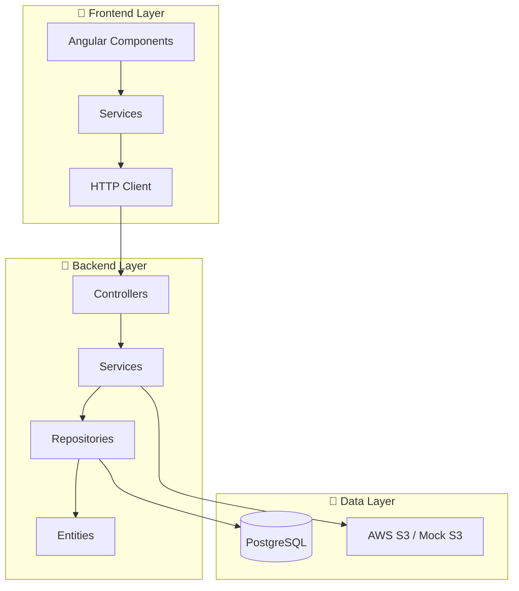
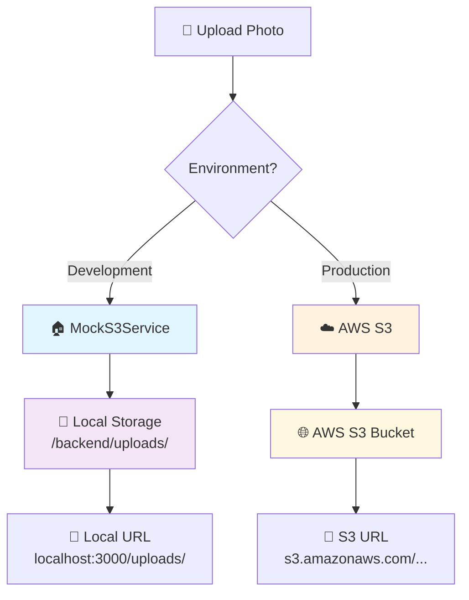

<div align="center">

# 📸 POV-WebApp

<p align="center">
  
  
  
</p>

<p align="center">
  <strong>Una aplicación web personal tipo "POV" para capturar y compartir momentos especiales</strong>
</p>

<p align="center">
  Permite a los usuarios registrarse, crear eventos, invitar personas y subir fotos de manera elegante y organizada.<br>
  Desarrollada como proyecto fullstack utilizando tecnologías modernas y buenas prácticas de arquitectura de software.
</p>

---

</div>

## 📋 Tabla de Contenidos

- [⚙️ Tecnologías Utilizadas](#️-tecnologías-utilizadas)
- [🧠 Arquitectura y Buenas Prácticas](#-arquitectura-y-buenas-prácticas)
- [🚀 Configuración e Instalación](#-configuración-e-instalación)
- [📸 Sistema de Fotos](#-sistema-de-fotos---desarrollo-local-vs-producción)
- [🌐 API Endpoints](#-api-endpoints)
- [🎯 MVP - Proyecto de Aprendizaje](#-mvp---proyecto-de-aprendizaje)

## ⚙️ Tecnologías Utilizadas

<table>
<tr>
<td width="50%">

### 🎨 Frontend
-  **Angular 18**
-  **TypeScript**
-  **Bootstrap**
-  **RxJS**

</td>
<td width="50%">

### 🔧 Backend
-  **Node.js + Express**
-  **TypeScript**
-  **PostgreSQL**
-  **TypeORM**

</td>
</tr>
<tr>
<td width="50%">

### 🔐 Autenticación & Storage
-  **JWT Tokens**
-  **AWS S3**

</td>
<td width="50%">

### 🧪 Testing & DevOps
-  **Jest**
-  **GitFlow**

</td>
</tr>
</table>

## 🧠 Arquitectura y Buenas Prácticas

<div align="center">



</div>

### 🏛️ Principios Arquitectónicos

> **Clean Architecture**: Separación clara por capas (Controller, Service, Repository, Entity)

- 🎯 **Principios SOLID** aplicados en todo el codebase
- 🔌 **Interfaces** para repositorios y servicios (inversión de dependencias)
- 📁 **Estructura basada en features** (ej: `User`, `Event`, `EventPhoto`)
- 🛡️ **Middleware de autenticación** (`authMiddleware.ts`)
- 🌿 **GitFlow**: desarrollo por ramas `feature/`, integración en `develop`, despliegue desde `main`
- 📚 **Proyecto en constante evolución** para aprender y aplicar buenas prácticas reales

### 🔍 Estructura del Proyecto

```
POV-WebApp/
├── 🎨 frontend/          # Angular Application
│   ├── src/app/
│   │   ├── pages/        # Feature pages
│   │   ├── services/     # Business logic
│   │   └── components/   # Reusable components
├── 🔧 backend/           # Node.js + Express API
│   ├── src/
│   │   ├── User/         # User domain
│   │   ├── Event/        # Event domain
│   │   ├── EventPhoto/   # Photo management
│   │   └── Shared/       # Common utilities
└── 📚 docs/              # Documentation
```

## 🌐 API Endpoints

<details>
<summary><strong>👤 Gestión de Usuarios</strong></summary>

### **POST /user** - Crear Usuario

```http
POST http://localhost:3000/user
Content-Type: application/json

{
  "name": "Juan Pérez",
  "email": "juan@example.com", 
  "password": "Password123"
}
```

**📋 Responses:**
- `201` ✅ User created successfully
- `400` ❌ Validation errors o email duplicado
- `500` 🔥 Internal server error

### **POST /auth/login** - Login Usuario

```http
POST http://localhost:3000/auth/login
Content-Type: application/json

{
  "email": "juan@example.com", 
  "password": "Password123"
}
```

**📋 Responses:**
- `200` ✅ Login exitoso + JWT token
- `401` ❌ Credenciales inválidas
- `500` 🔥 Error interno del servidor

</details>

<details>
<summary><strong>🎉 Gestión de Eventos</strong></summary>

### **POST /event** - Crear Evento

> 🔐 **Requiere autenticación**

```http
POST http://localhost:3000/event
Authorization: Bearer <JWT_TOKEN>
Content-Type: application/json

{
  "title": "Mi Cumpleaños",
  "date": "2025-12-25T20:00:00.000Z",
  "location": "Mi Casa"
}
```

**📋 Responses:**
- `201` ✅ Event created successfully
- `400` ❌ Validation errors o título duplicado
- `401` 🔐 Token requerido, inválido o expirado
- `403` 🚫 Token válido pero sin permisos
- `500` 🔥 Internal server error

### **GET /events** - Obtener Eventos del Usuario

> 🔐 **Requiere autenticación**

```http
GET http://localhost:3000/events
Authorization: Bearer <JWT_TOKEN>
```

**📊 Response format:**
```json
{
  "owner": [ /* eventos donde el usuario es owner */ ],
  "invited": [ /* eventos donde el usuario está invitado */ ]
}
```

**📋 Responses:**
- `200` ✅ Lista de eventos (propios e invitado)
- `401` 🔐 Token requerido, inválido o expirado
- `500` 🔥 Internal server error

### **POST /event/:id/invite** - Invitar Usuarios

> 🔐 **Requiere autenticación**

```http
POST http://localhost:3000/event/<EVENT_ID>/invite
Authorization: Bearer <JWT_TOKEN>
Content-Type: application/json

{
  "invitees": ["ana@example.com", "pepe@example.com"]
}
```

**📋 Responses:**
- `200` ✅ Invitations processed
- `400` ❌ Errores de validación
- `401` 🔐 Token requerido, inválido o expirado
- `403` 🚫 Forbidden (no eres el owner del evento)
- `500` 🔥 Internal server error

</details>

<details>
<summary><strong>📸 Gestión de Fotos</strong></summary>

### **POST /event/:id/photos** - Subir Foto

> 🔐 **Requiere autenticación** | 📏 **Límite: 5 fotos por usuario por evento**

```http
POST http://localhost:3000/event/<EVENT_ID>/photos
Authorization: Bearer <JWT_TOKEN>
Content-Type: multipart/form-data

Form data:
- photo: archivo de imagen (máx 5MB)
- caption: descripción opcional
```

**📋 Responses:**
- `201` ✅ Foto subida exitosamente
- `400` ❌ No se proporcionó archivo, formato inválido, o límite alcanzado
- `401` 🔐 Token requerido, inválido o expirado
- `500` 🔥 Internal server error

### **GET /event/:id/photos** - Ver Fotos del Evento

> 🔐 **Requiere autenticación**

```http
GET http://localhost:3000/event/<EVENT_ID>/photos
Authorization: Bearer <JWT_TOKEN>
```

**📋 Responses:**
- `200` ✅ Array de fotos con URLs, metadatos y usuario
- `401` 🔐 Token requerido, inválido o expirado
- `500` 🔥 Internal server error

### **DELETE /photo/:id** - Eliminar Foto Propia

> 🔐 **Requiere autenticación** | ⚠️ **Solo puedes eliminar tus propias fotos**

```http
DELETE http://localhost:3000/photo/<PHOTO_ID>
Authorization: Bearer <JWT_TOKEN>
```

**📋 Responses:**
- `200` ✅ Foto eliminada exitosamente
- `400` ❌ UUID inválido
- `401` 🔐 Token requerido, inválido o expirado
- `403` 🚫 No tienes permisos para eliminar esta foto
- `404` 🔍 Foto no encontrada
- `500` 🔥 Internal server error

</details>

## 🚀 Configuración e Instalación

### 📋 Prerrequisitos

<table>
<tr>
<td width="33%" align="center">

<br><strong>Node.js 16+</strong>
</td>
<td width="33%" align="center">

<br><strong>PostgreSQL</strong>
</td>
<td width="33%" align="center">

<br><strong>AWS S3</strong><br><small>(solo para producción)</small>
</td>
</tr>
</table>

### ⚙️ Variables de Entorno

1. **Copia el archivo de ejemplo:**
   ```bash
   cp backend/.env.example backend/.env
   ```

2. **Configura las variables en `backend/.env`:**

<details>
<summary><strong>🔐 Configuración JWT</strong></summary>

```env
# JWT Configuration
JWT_SECRET=tu_clave_secreta_muy_segura_aqui
JWT_EXPIRES_IN=24h
```

</details>

<details>
<summary><strong>🗄️ Configuración Base de Datos</strong></summary>

```env
# Database Configuration
DB_HOST=localhost
DB_PORT=5432
DB_USERNAME=tu_usuario
DB_PASSWORD=tu_password
DB_NAME=pov_webapp
```

</details>

<details>
<summary><strong>☁️ Configuración AWS S3 (Producción)</strong></summary>

```env
# AWS S3 Configuration (Production only)
NODE_ENV=production
AWS_ACCESS_KEY_ID=tu_access_key
AWS_SECRET_ACCESS_KEY=tu_secret_key
AWS_REGION=us-east-1
AWS_S3_BUCKET_NAME=tu-bucket-name
```

</details>

### 🛠️ Instalación y Ejecución

<details>
<summary><strong>📦 Backend Setup</strong></summary>

```bash
# 1. Navegar al directorio backend
cd backend

# 2. Instalar dependencias
npm install

# 3. Configurar base de datos
# Asegúrate de que PostgreSQL esté ejecutándose
# Crear la base de datos: pov_webapp

# 4. Ejecutar migraciones (si aplica)
npm run migration:run

# 5. Iniciar servidor de desarrollo
npm run dev
```

**🌐 El backend estará disponible en:** `http://localhost:3000`

</details>

<details>
<summary><strong>🎨 Frontend Setup</strong></summary>

```bash
# 1. Navegar al directorio frontend
cd frontend

# 2. Instalar dependencias
npm install

# 3. Iniciar servidor de desarrollo
ng serve
```

**🌐 El frontend estará disponible en:** `http://localhost:4200`

</details>

## 📸 Sistema de Fotos - Desarrollo Local vs Producción

<div align="center">



</div>

### 🏠 Desarrollo Local (Mock S3)

Para facilitar el desarrollo, el sistema incluye un **MockS3Service** que simula AWS S3 localmente:

<details>
<summary><strong>🔧 ¿Cómo funciona el Mock?</strong></summary>

- **📁 Almacenamiento**: Las fotos se guardan en `backend/uploads/` (sistema de archivos local)
- **🔗 URLs**: Se generan como `http://localhost:3000/uploads/filename.jpg`
- **⚡ Activación**: Automática cuando `NODE_ENV=development`

</details>

<details>
<summary><strong>✨ Ventajas del Mock</strong></summary>

- ⚡ **Más rápido**: Sin latencia de red
- 💰 **Gratis**: No requiere cuenta AWS
- 🎯 **Simple**: No necesitas configurar credenciales AWS
- 👁️ **Visible**: Puedes ver los archivos guardados localmente

</details>

#### 🛠️ Para usar el Mock:

1. **Asegúrate que `NODE_ENV=development` en tu `.env`**

2. **No necesitas configurar las variables AWS:**
   ```env
   # ❌ Estas NO son necesarias en desarrollo:
   # AWS_ACCESS_KEY_ID=
   # AWS_SECRET_ACCESS_KEY=
   # AWS_REGION=
   # AWS_S3_BUCKET_NAME=
   ```

3. **✅ El sistema automáticamente usará el MockS3Service**

4. **📂 Las fotos se guardarán en `backend/uploads/`**

---

### ☁️ Producción (AWS S3 Real)

En producción (`NODE_ENV=production`), el sistema usa AWS S3 real:

#### 🔧 Configuración requerida:

```env
NODE_ENV=production
AWS_ACCESS_KEY_ID=tu_access_key
AWS_SECRET_ACCESS_KEY=tu_secret_key
AWS_REGION=us-east-1
AWS_S3_BUCKET_NAME=tu-bucket-name
```

#### 🔄 ¿Cómo cambiar entre Mock y S3 real?

El cambio es **automático** basado en `NODE_ENV`:

```typescript
// En EventPhotoService.ts
if (process.env.NODE_ENV === 'development') {
  this.s3Service = new MockS3Service(); // 🏠 Mock local
} else {
  this.s3Service = new S3Service(); // ☁️ AWS S3 real
}
```

#### 📁 Estructura de archivos:

```
backend/
├── src/
│   └── EventPhoto/
│       ├── S3Service.ts        # ☁️ AWS S3 real
│       ├── MockS3Service.ts    # 🏠 Mock para desarrollo
│       └── EventPhotoService.ts # 🧠 Lógica que elige cuál usar
└── uploads/                    # 📂 Fotos en desarrollo (creado automáticamente)
```

### 💡 Recomendación:

<table>
<tr>
<td width="50%" align="center">
<h4>🏠 Desarrollo</h4>
<p><strong>Usa el Mock</strong><br>(configuración por defecto)</p>

</td>
<td width="50%" align="center">
<h4>🚀 Producción</h4>
<p><strong>Configura AWS S3 real</strong></p>

</td>
</tr>
</table>

> 🎯 **El sistema funciona idénticamente en ambos casos.**

## 🎯 MVP - Proyecto de Aprendizaje

<div align="center">

> ### 🌟 "Un viaje de crecimiento técnico y profesional"

</div>

Este proyecto representa mi **MVP (Minimum Viable Product)** desarrollado como parte de mi crecimiento profesional como desarrollador. A través de esta aplicación he aplicado y consolidado conocimientos sobre:

<table>
<tr>
<td width="50%">

### 🏗️ **Arquitectura & Patterns**
- 🎯 **Clean Architecture**
- 💎 **Principios SOLID**
- 🔄 **Repository Pattern**
- 🏭 **Service Layer Pattern**

</td>
<td width="50%">

### 💻 **Stack Tecnológico**
- 🟦 **Backend moderno**: Node.js, TypeScript, Express
- 🐘 **Base de datos**: PostgreSQL con TypeORM
- 🅰️ **Frontend**: Angular con componentes standalone
- ☁️ **Cloud**: AWS S3 para almacenamiento

</td>
</tr>
<tr>
<td width="50%">

### 🧪 **Testing & Calidad**
- ✅ **Jest** con mocks y buenas prácticas
- 🔍 **Test-driven development**
- 📊 **Code coverage**
- 🛡️ **Validación de datos**

</td>
<td width="50%">

### 🚀 **DevOps & Metodologías**
- 🌿 **GitFlow** workflow
- ⚙️ **Variables de entorno**
- 📝 **Documentación completa**
- 🔄 **Separación de responsabilidades**

</td>
</tr>
</table>

---

<div align="center">

### 💭 Reflexión Personal

*El proyecto refleja mi evolución técnica y mi enfoque en escribir código limpio, mantenible y bien documentado. Cada feature implementada ha sido una oportunidad para profundizar en las mejores prácticas de desarrollo fullstack moderno.*

### 🎓 Lo que he aprendido

**Técnico:** Clean Architecture, SOLID, Testing, TypeScript avanzado, Angular moderno  
**Metodológico:** GitFlow, documentación técnica, separación de concerns  
**Profesional:** Código mantenible, buenas prácticas, arquitectura escalable

---

<p>


</p>

</div>
